# PROTOTYPE — exercise detail screen

Throwaway. Answers [Prototype the exercise detail screen: curve or table?](https://github.com/hermanno3005/Chalk/issues/7).

Three variants of the exercise detail screen, switchable from a floating bottom bar,
over four sample datasets and both exercise kinds — so "what does the curve look like
with four points?" and "where does the machine qualifier go?" are each one tap away.

The Log button opens the *winning* log sheet from
[Prototype the log-entry modal](https://github.com/hermanno3005/Chalk/issues/6)
(variant A, staged steppers), so each screen is judged with its real primary action attached.

## Round two — curve-first won, now how big?

The dev picked **curve-first**, with three notes: the curve is too big, scrubbing did not
work, and there is no navigation chrome. So the switcher now varies only the curve's
height — everything else held constant — and the three screens are:

| | Curve height | Y axis | Title |
|---|---|---|---|
| **Sparkline** | 56pt | hidden | large |
| **Compact** | 150pt | shown | large |
| **Half** | 240pt | shown | inline |

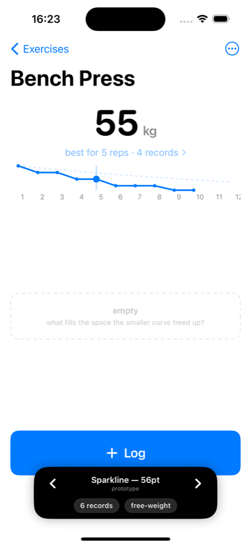 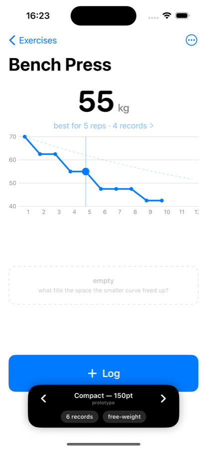 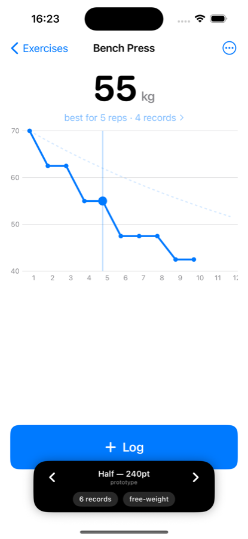 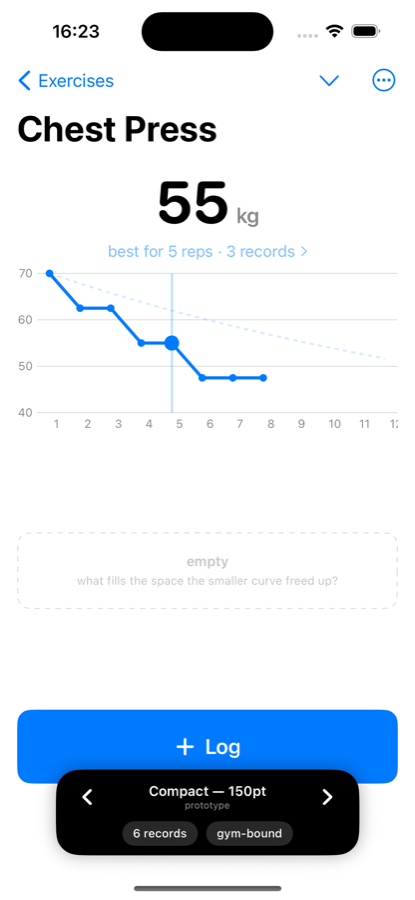

Two fixes came with it:

- **Scrubbing.** Round one hand-rolled a `DragGesture` in a `chartOverlay` and layered a
  tap gesture on top of it; the two fought and the drag usually did nothing. It now uses
  Charts' own `chartXSelection`, which handles both tap and drag.
- **Navigation chrome.** A back button (`‹ Exercises`) and an overflow menu (rename / edit
  records / delete) now sit in the toolbar. **Both are dead** — placement only, so the
  screen can be judged with its real chrome. What is actually behind them belongs to
  [Prototype the exercise library screen](https://github.com/hermanno3005/Chalk/issues/8)
  and [What happens when a record is wrong?](https://github.com/hermanno3005/Chalk/issues/11).

Shrinking the curve leaves a hole between it and the Log button. It is deliberately left
**empty and labelled** rather than filled — what belongs there is the open question this
round hands back.

Round one's table-first and answer-first screens are still in the tree
(`DetailVariantB.swift`, `DetailVariantC.swift`) as the primary source of that comparison.
They are no longer reachable from the switcher.

## Run it

Open `Chalk/Chalk.xcodeproj` on this branch and run. The app is rooted at
`ExerciseDetailPrototypeRoot`. The black pill at the bottom carries three controls:

- **‹ ›** — cycle curve height: sparkline / compact / half.
- **dataset pill** — cycle `1 record` → `4 records, gappy` → `6 records` → `26 records`.
- **kind pill** — flip between `free-weight` (Bench Press) and `gym-bound` (Chest Press,
  three machines across three gyms).

All three persist across relaunch. Sample data is in memory only.

## The variants

| | Primary thing | Curve | Table | Log button | Machine qualifier |
|---|---|---|---|---|---|
| **A — Curve-first** | The shape, full-bleed | The screen | none — drag the curve to read a number | full-width bar, bottom | nav-bar menu |
| **B — Table-first** | Rows 1–12, weight in the biggest type | 44pt sparkline that expands on tap | the screen | floating pill, bottom-right | segmented control above the table |
| **C — Answer-first** | Last-time card + 12 chunky rep tiles | behind a `Numbers / Curve` segmented control | a 3-column tile grid | full-width bar, bottom | chip inside the card |

Every variant reaches history the same way — tap a rep count, get every record with
`reps >= n`, the one currently setting the best flagged. That much was already decided in
[What exactly counts as a record?](https://github.com/hermanno3005/Chalk/issues/3);
the variants only disagree about what you tap.

## What each one is arguing

- **A** argues the curve *is* the information: you read your shape at a glance and pull
  exact numbers by dragging. It buys a beautiful screen and it makes "what do I load for 5?"
  a deliberate act rather than a glance.
- **B** argues you came here for a number, not a picture, so show twelve of them. It is the
  only variant that makes monotonic backfill visible — an inherited row is dimmed and says
  `from 8 × 47.5`. It costs the curve its presence: a 44pt sparkline is decoration until tapped.
- **C** argues neither is primary — the *answer* is. It opens on what you did last time and a
  thumb-sized grid, and it refuses to let the curve share the screen at all. It costs a mode
  switch and it is the only variant where the curve is genuinely out of sight.

## Things the screenshots settle

- **The curve is a staircase, not a line.** Monotonic backfill means every rep count without
  a direct record repeats the one above it. With 6 records you get four visible steps; with
  one record you get a flat line at your only weight. Any variant that leans on the curve is
  leaning on that shape.
- **The Epley ghost reads as guidance at typical density and as an accusation when sparse** —
  with one record it sits far above a flat line the whole way across.
- **Dimming an inherited value works.** B and C both grey the carried-down numbers, and the
  distinction survives at a glance without a legend.

## Screenshots

**A — Curve-first**, 6 records · 4 records, gappy · 1 record · with the log sheet open

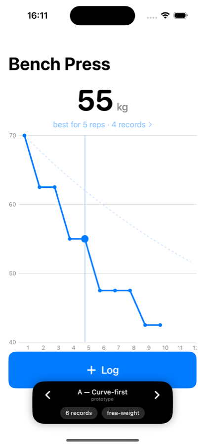 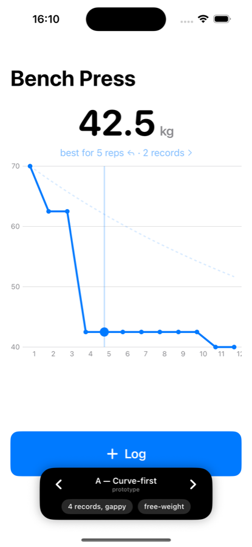 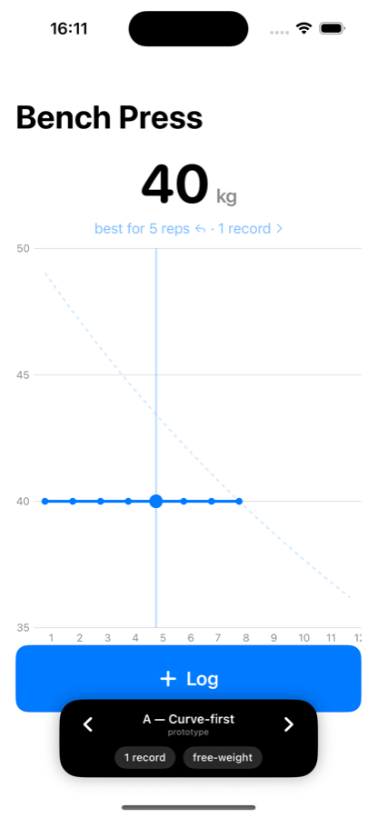 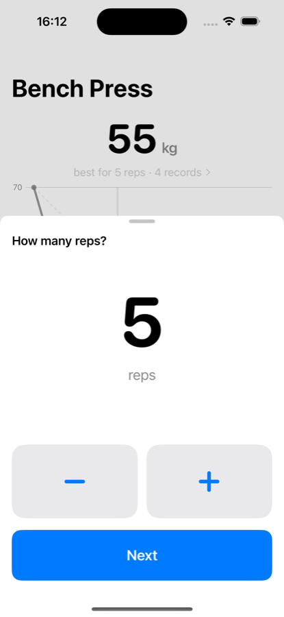

**B — Table-first**, default · curve expanded · history sheet · gym-bound

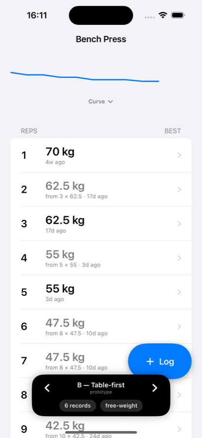 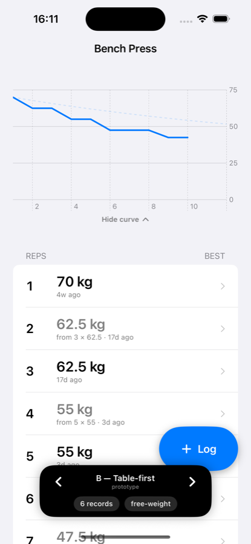 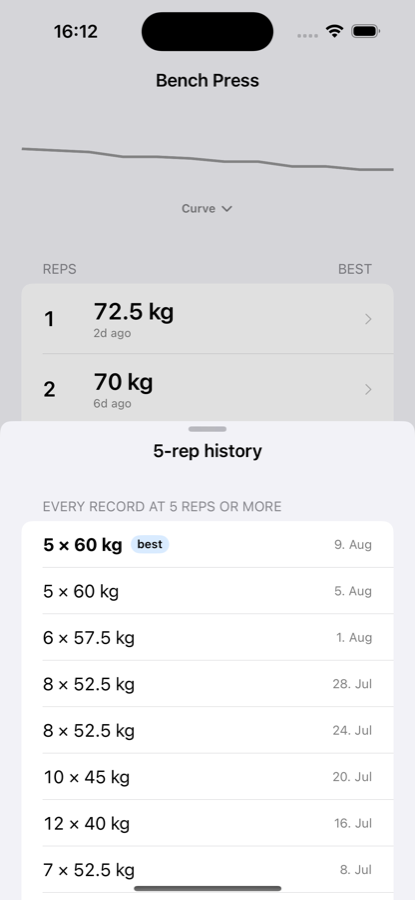 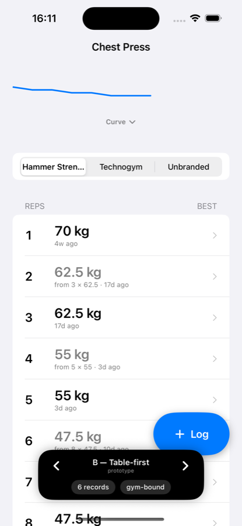

**C — Answer-first**, default · gym-bound · 26 records

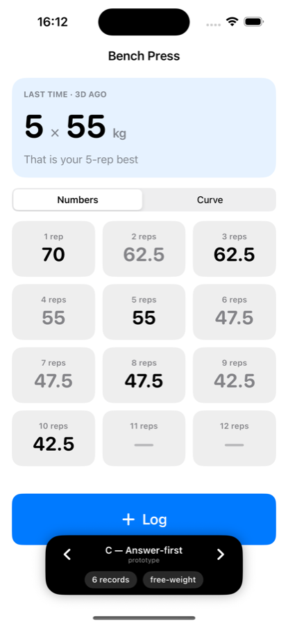 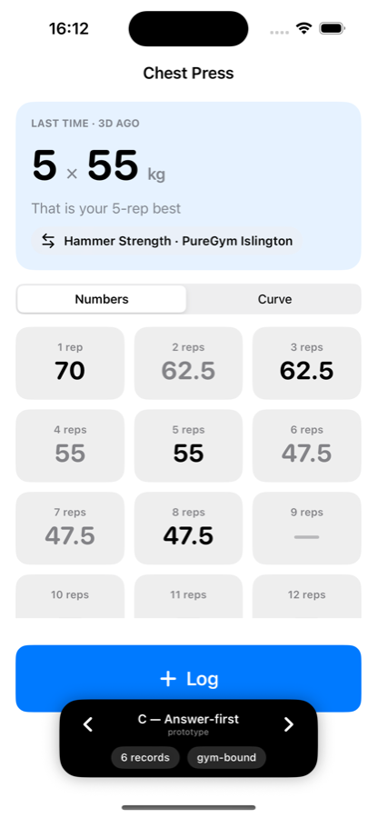 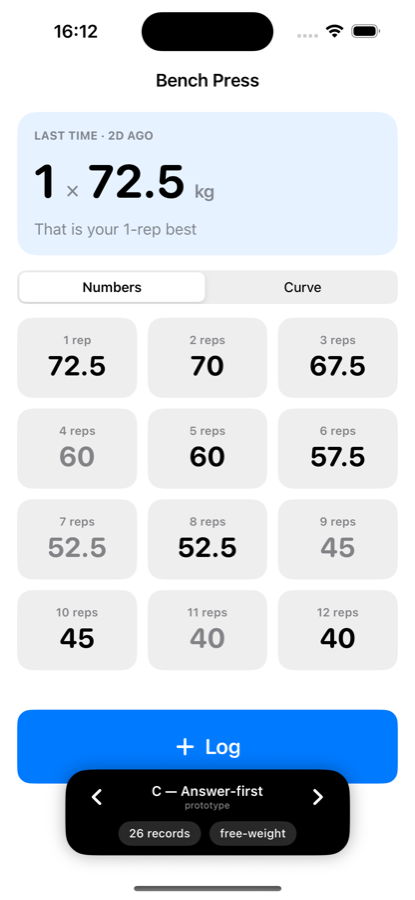

## Assumptions, not decisions

- Weight increments are 2.5 kg and units are kg — still fog on [the map](https://github.com/hermanno3005/Chalk/issues/1).
- The rep axis is fixed 1–12, per [ticket 3](https://github.com/hermanno3005/Chalk/issues/3).
- No variant shows history *over time* (a "5RM this year" trend). That is deliberate — it is a
  separate open question, and putting it on the screen would have muddied the comparison.
- Editing or deleting a record is absent everywhere; that belongs to
  [What happens when a record is wrong?](https://github.com/hermanno3005/Chalk/issues/11).
