# PROTOTYPE — exercise library screen

Throwaway. Answers [Prototype the exercise library screen](https://github.com/hermanno3005/Chalk/issues/8).

**Round one verdict: C — resume card, tiles, type to find.**
**Round two verdict: not yet — awaiting the dev.**

Three variants of the app's home screen, switchable from a floating bottom bar, over
four library sizes — so "empty first launch", "three exercises", and "forty-two
exercises" are each one tap away.

Judged against the real app rather than in a vacuum: a row navigates into the
**winning** exercise detail screen from
[issue 7](https://github.com/hermanno3005/Chalk/issues/7) (curve-first, 150pt), and every
log shortcut opens the **winning** log sheet from
[issue 6](https://github.com/hermanno3005/Chalk/issues/6) (staged steppers). So
"how many taps from cold launch to logged?" can be counted rather than argued about.

Two framing answers from the dev shaped the set: the library holds **35–50 exercises**
once settled, and the variants should **disagree** about whether you can log from the
list — which is exactly the fork below.

## Round two — C won, now group the tiles

The dev picked **C** ("clean and easy to navigate") with one note: the flat grid *feels
unordered*, and wants exercises grouped — compounds at the top, the rest grouped somehow,
axis unsure.

Grilling settled what the grouping is **for**, and that is the decision that made the rest
cheap. Two candidate jobs were on the table:

- *Finding a rarely-used exercise* — but search already does that, and typing three letters
  beats scanning a grouped list. Grouping loses this one.
- *Browsing what's related* — you've finished squats and want to see what else is legs.
- **Just structure** — the flat grid reads as a pile and grouping makes it legible.

The dev picked **structure**. That is the cheapest answer available, and it changes the
design: grouping is *presentation*, so it does not have to beat search at anything. It only
has to make the pile scannable.

Which in turn dissolves a taxonomy problem. "Compound" is not a muscle group — a squat is
both — so as a classification the model is incoherent. But the dev also asked for
**drag an exercise into a category**, and that settles it: groups are **your own ordered
buckets**, not a taxonomy. Incoherence is fine on a shelf you arranged yourself.

So:

- **Nothing is asked at create time.** The create form is unchanged from round one. New
  exercises land in **Ungrouped**.
- **You assign by dragging a tile into a group**, later, like arranging app icons.
- **Groups are user-owned** — ordered, renameable. The app ships `Compound / Legs / Push /
  Pull / Core` as a suggestion, not a schema.

Everything above the grouping — resume card, tiles, search field, create-from-search — is
**held constant** from round one. The three screens disagree only about how grouping is
presented.

| | Structure | Ungrouped bucket is | Assign by dragging onto |
|---|---|---|---|
| **C1 — Sectioned grid** | every group a section, one long scroll | last section, past 42 tiles | a section |
| **C2 — Recent, then groups** | recent strip, then collapsible sections | last section, collapsible | a section header (works collapsed) |
| **C3 — Group chips filter** | one grid, horizontal chip row filters it | **one tap away**, a chip | a chip |

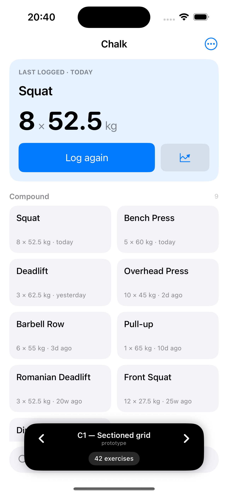  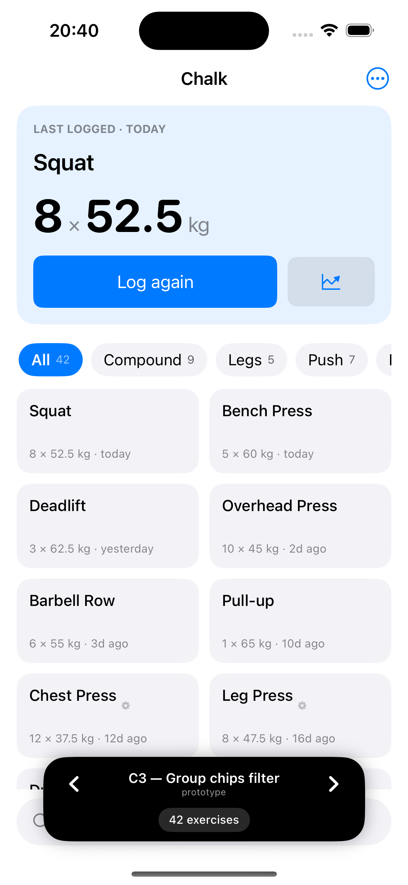 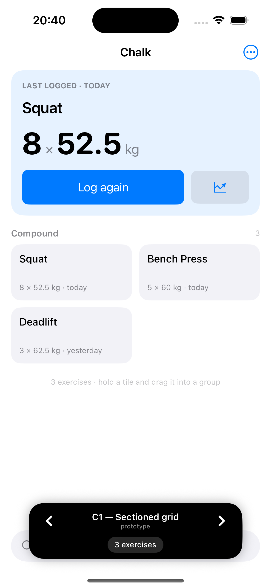 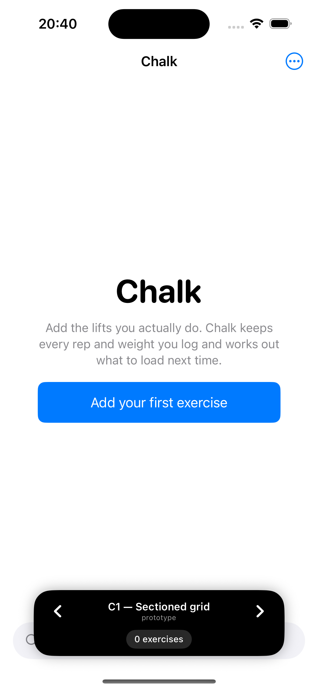

### What round two settles

- **Recency and grouping compete for the same tiles.** C2's first cut put Recent in the same
  two-column grid as the sections, and Squat / Bench / Deadlift / Overhead Press appeared
  **twice on one screen** — because the exercises you did most recently are the compounds, so
  Recent and the first group are nearly the same four tiles. Making Recent a horizontal strip
  of small chips fixes the *look* but not the fact: C2 shows some exercises twice, and that is
  its standing cost.
- **The Ungrouped bucket is the whole tidy-up story, and C1/C2 bury it.** It is the one
  section you actually need to reach, and in a sectioned scroll it sits below every other
  group — you drag a tile down past forty others to file it. C3 puts it one tap from the
  top, next to every other drop target. If drag-to-assign is the assignment model, C3 is the
  only layout that makes assignment convenient.
- **Grouping does nothing at three exercises.** `r2-c1-small.png` is a single "Compound"
  header over three tiles — a header earning its keep by labelling everything on screen. The
  structure only starts paying at twenty-ish.
- **Round two fixed round one's worst screen.** C's empty state was a wordmark and a search
  field; it now carries variant A's copy and a primary button, so first launch says what the
  app is for.

### Still assumed, not decided

- **Group vocabulary.** `Compound / Legs / Push / Pull / Core` is a placeholder. Renaming and
  reordering groups is stubbed ("Edit groups" in the overflow does nothing).
- **Where the current gym lives.** Still the overflow menu; feeds
  [issue 13](https://github.com/hermanno3005/Chalk/issues/13).
- **What ordering applies *within* a group.** Currently recency. Alphabetical is the obvious
  alternative and nobody has argued for either.
- **Whether a group should also be a drop target for reordering itself.** Sections can be
  reordered in the model (`moveGroup`) but no screen exposes it.

Round one's A and B remain in the tree (`LibraryVariantA.swift`, `LibraryVariantB.swift`) as
the primary source of that comparison. They are no longer reachable from the switcher.

## Round one — the variants

| | Ordering | Log from the list? | Cold launch → logged | Where the current gym lives |
|---|---|---|---|---|
| **A — Directory** | A–Z, sectioned, scrub index | **No** — the detail screen's Log bar is the only way | 3 taps + save | nowhere yet |
| **B — Recency + row Log** | Today / This week / Everything else | **Yes** — a Log pill on every row | **2 taps + save** | nav bar, always visible |
| **C — Resume, then type** | one big card + 8 recent tiles; no list | **Yes** — "Log again" is the biggest target on screen | **1 tap + save** for a repeat | overflow menu |

## What each one is arguing

- **A** argues the library is a *directory* whose only job is to get out of the way. One
  concept, one path: rows go to detail, detail logs. The alphabet means you always know
  where a given exercise is *before* you look — the only ordering that never moves.
  It accepts being the slowest to log and being indifferent to what you did five minutes ago.
- **B** argues you did not open Chalk to browse — you opened it mid-set, and the exercise
  you want is one you touched in the last hour or the last week. The detail screen becomes
  the place you go to *look*, not the place you go to *log*. It accepts that rows move
  around as you use the app, so you can never learn where anything is, and that a rarely
  used exercise sinks into a long alphabetical tail.
- **C** argues that at 42 exercises no list is fast but three letters always is, and that
  the single likeliest thing you want is another set of what you just did — so that gets
  the biggest target on the screen instead of a row. Find and create are the same gesture:
  type a name that does not exist and the last result is "Create it". It accepts that you
  cannot browse at all.

## Things the screenshots settle

- **The alphabet earns its keep at 42 and is dead weight at 3.** A's scrub index is the
  difference between navigable and a scroll, but B at three exercises is a screen with
  three rows on it and nothing else — and B is obviously better there.
- **B's banding does most of A's work for free.** With a realistic library, Today and This
  week hold five rows between them, which is very nearly always the exercise you want.
  "Everything else" being alphabetical means B is not actually giving up the directory —
  it is demoting it.
- **Progressive disclosure answers the machine-flag question.** The create form is one name
  field and a two-way segmented control; the gym and make fields *do not exist* until you
  say "gym machine". The common case never sees them. Each option carries a one-line
  footer stating the test from
  [issue 2](https://github.com/hermanno3005/Chalk/issues/2) — does the load transfer between
  gyms? — so the choice is decidable without knowing the domain model.
- **C's empty state is the weakest screen in the set.** With nothing logged there is no
  resume card and no grid, so the whole argument evaporates and you are left with a
  wordmark and a search field. A's empty state is the only one that actually tells you
  what the app is for.
- **A has nowhere to put the current gym.** B parks it in the nav bar and C hides it in the
  overflow menu; A's nav bar is already carrying search and `+`. That is a real cost of the
  A-Z layout, and it feeds
  [Where does gym and machine resolution live in the log sheet?](https://github.com/hermanno3005/Chalk/issues/13).

## Run it

Open `Chalk/Chalk.xcodeproj` on this branch and run. The app is rooted at
`ExerciseLibraryPrototypeRoot`. The black pill at the bottom carries two controls:

- **‹ ›** — cycle grouping layout: Sectioned / Recent-then-groups / Chips.
- **size pill** — cycle `0 exercises` → `3` → `18` → `42`.

Both persist across relaunch. Sample data is in memory only.

Screenshot hooks (launch arguments): `-autoCreate 1` opens the create sheet,
`-autoGymBound 1` opens it with the machine fields disclosed, `-autoLogFirst 1` opens the
log sheet for the most recent exercise.

## Screenshots

**A — Directory**, 18 · 42 · empty

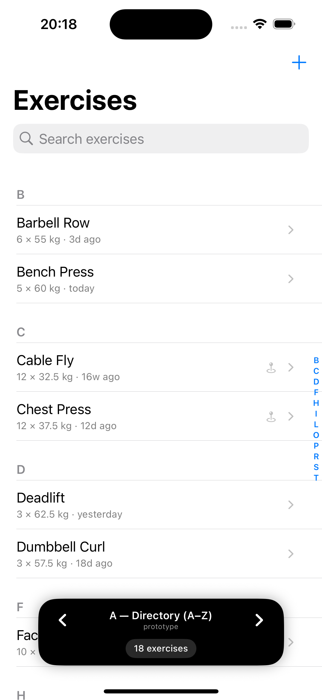 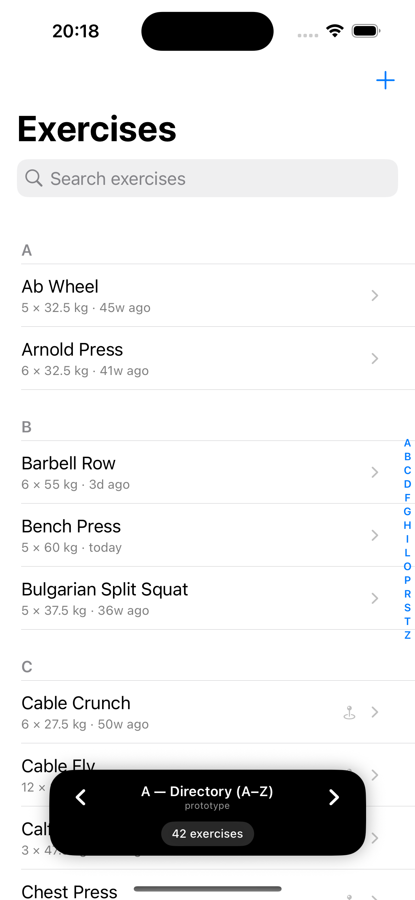 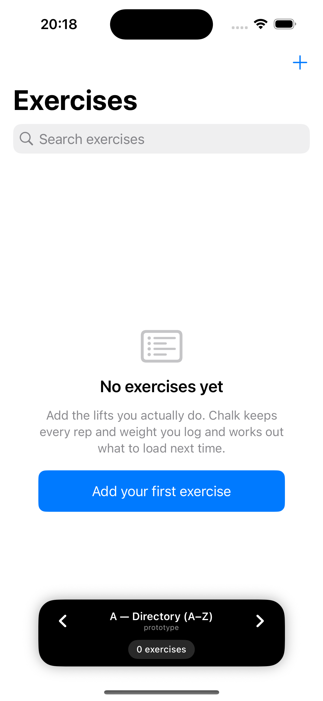

**B — Recency + row Log**, 18 · 42 · 3 · log sheet from a row

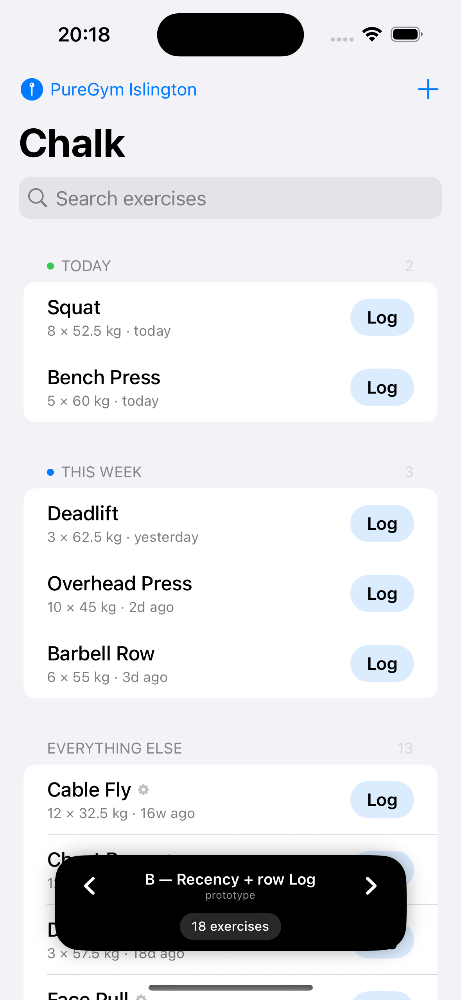  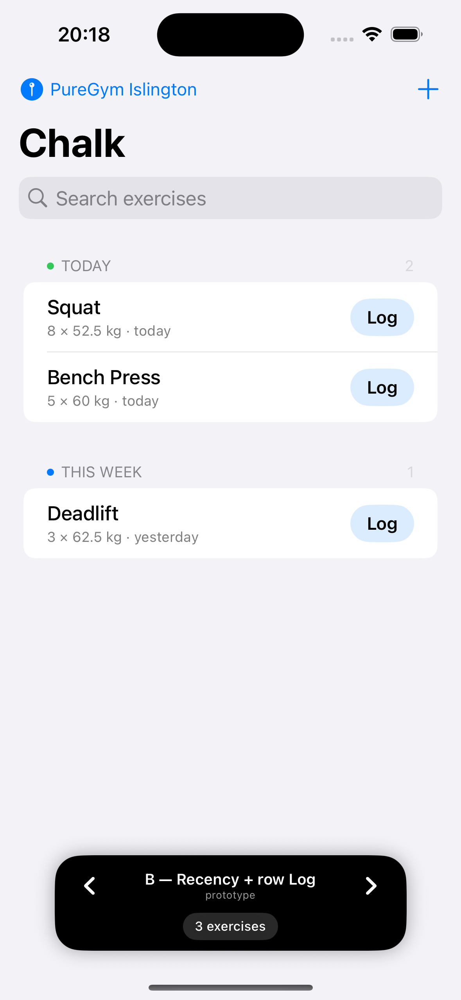 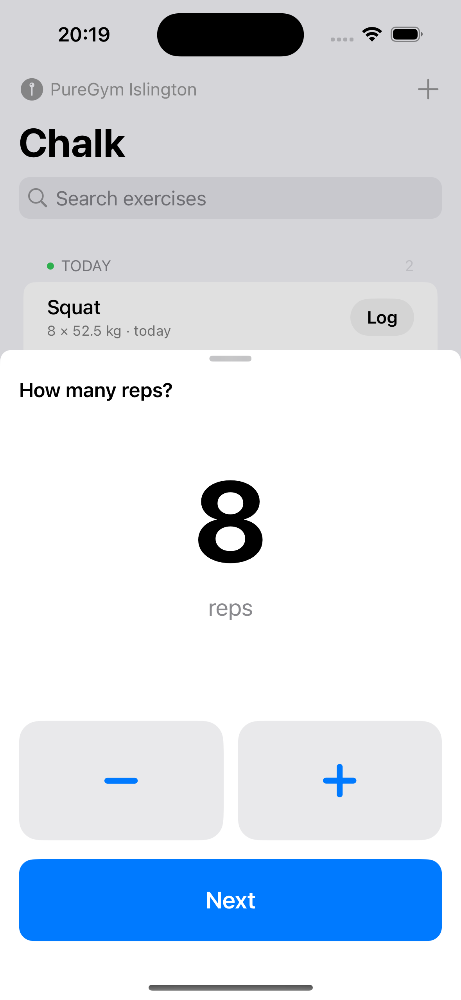

**C — Resume, then type**, 18 · 42 · empty

  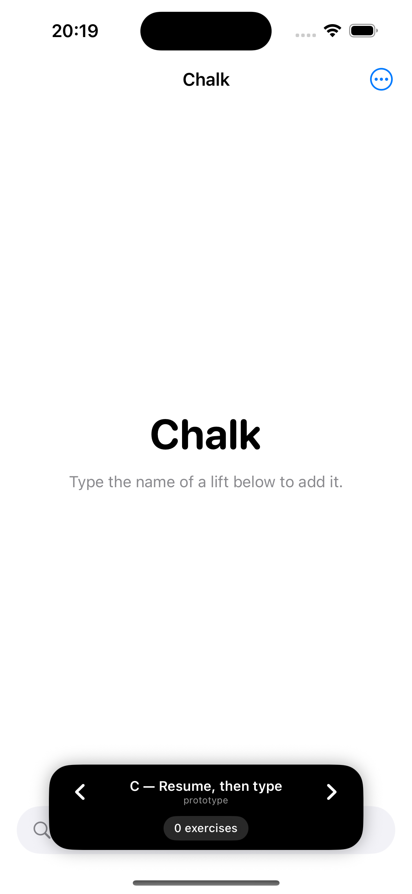

**Create exercise** (shared by all three), free weight · gym machine

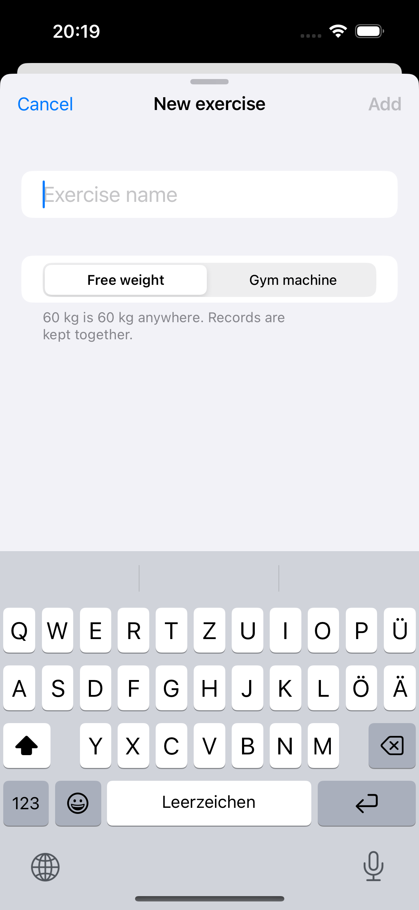 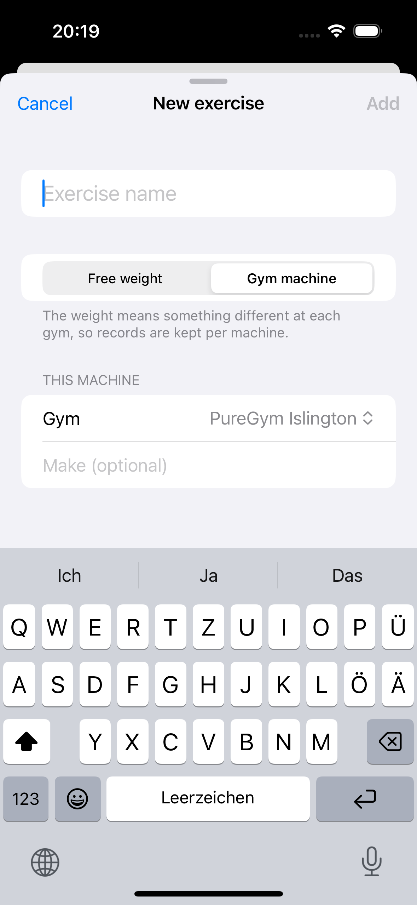

## Shared on purpose

The create sheet and the delete confirmation are **shared across all three variants**. The
variants disagree about how you *find* an exercise and whether you can log from the list;
they do not disagree about the create form, so varying it would only have added noise.

Delete is a confirmation dialog that names the record count out loud —
"Delete exercise and 6 records" — because the count is the only thing that makes the
consequence concrete. What happens to records on delete is offered here, not decided;
that argument belongs to
[What happens when a record is wrong?](https://github.com/hermanno3005/Chalk/issues/11).

## Assumptions, not decisions

- **The A–Z scrub index is faked.** SwiftUI's `List` has no native section-index API, so A
  draws a static letter column down the right edge. It shows the *placement* and the cost
  in horizontal space; it does not scroll. A real build needs `UITableView` interop or a
  hand-rolled scroll-to-section.
- **Weight units are kg and increments 2.5 kg** — still fog on
  [the map](https://github.com/hermanno3005/Chalk/issues/1).
- **Rename is a bare alert in A and absent from B and C.** Placement only.
- **Gym switching is a stub.** Picking a different gym re-scopes nothing in the prototype;
  it is there so the control can be judged for placement.
- **No exercise is bundled.** The library starts genuinely empty, per the map.
