# PROTOTYPE — how is a goal presented?

Throwaway. Answers [How is a goal presented?](https://github.com/hermanno3005/Chalk/issues/64),
a ticket on [Map: Goals — a number to head toward](https://github.com/hermanno3005/Chalk/issues/62).

> **Round one verdict: B — the goal is a line under the scrub readout — and a reached
> goal greys out rather than celebrating.** Round two, below, varies only what that line
> carries and makes the Log bar live. **Round two verdict: open.**

Four structurally different answers, mounted on the real exercise detail screen — real
scrub readout, real 150 pt curve, real ghost, real Log bar — so each is judged against
what it is actually competing with for space.

## Run it

Check out the `prototype-goals` branch, open `Chalk/Chalk.xcodeproj` and run. The app is
rooted at `GoalsPrototypeRoot`, not `LibraryView`. The black pill at the bottom carries:

- **‹ ›** — cycle the round-two variant.
- **dataset pill** — `6 entries` → `0 entries` → `1 entry`.
- **goal pill** — `far` (140 × 5) → `close` (102.5 × 5) → `reached` (95 × 5) → `no goal`.
- **origin pill** — `from set` / `from 0`, what a proportional glyph counts from.
- **ghost pill** — the ghost on or off.
- **reset pill** — throw away what you logged in the prototype.

**The Log bar is live.** Each tap logs 2.5 kg above where the curve stands, at the goal's
rep count, so the gap, the glyph and the curve move together and the presentation can be
judged in motion rather than in stills.

Sample data is in memory only; nothing is stored. The same combinations can be launched
directly — `-r2 R2 -dataset "0 entries" -goal far -origin "from set" -prelog 3` — which is
how these screenshots were taken. Round one's switcher took `-variant A` instead.

## The four

| | Where the goal lives | Chart | Readout | Empty space |
|---|---|---|---|---|
| **A — Curve marker** | a dashed rule at the goal weight, plus a hollow point at its rep count | marked | untouched | empty |
| **B — Gap under readout** | one line under `best for N reps` | untouched | gains a line | empty |
| **C — Card in the empty space** | a labelled progress bar below the curve | untouched | untouched | **filled** |
| **D — The gap is the headline** | the big number *becomes* the gap | untouched | **replaced** | empty |

## A — Curve marker

6 entries · 1 entry · 0 entries · reached · ghost off

 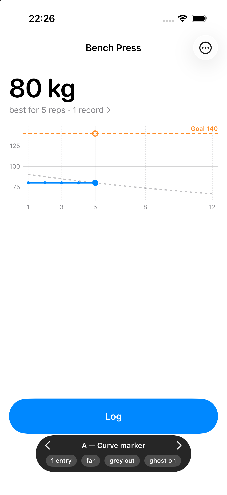 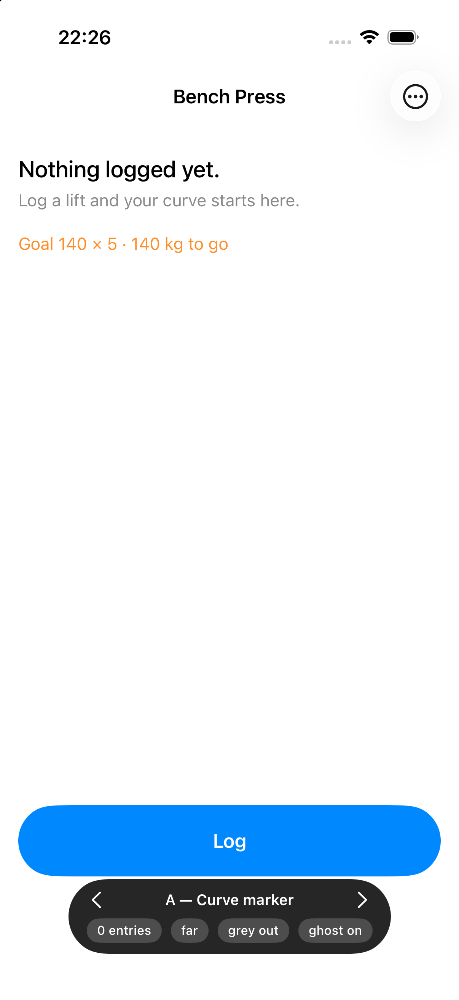  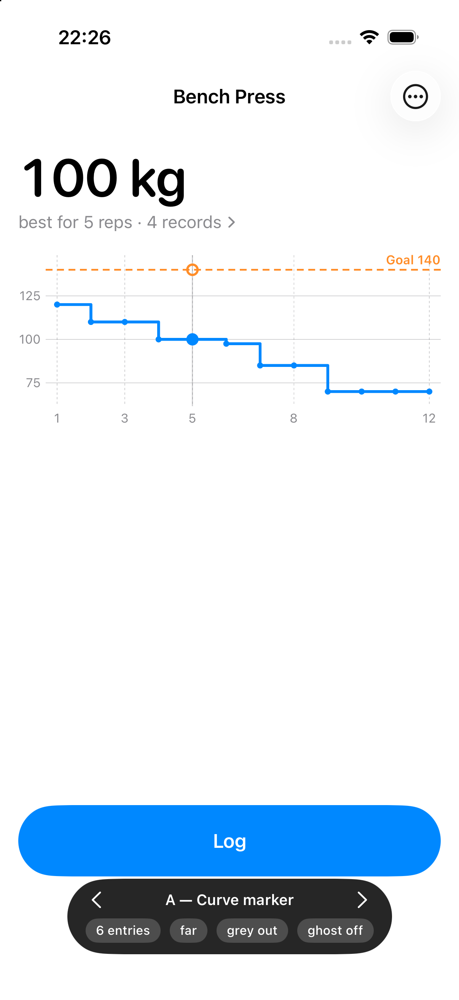

Three things the screenshots settle, all of them costs:

- **It cannot render alone.** With no entries there is no chart, so the goal falls back to
  a line of text — which *is* variant B. A is therefore never one presentation; it is two,
  and B is the second one.
- **A goal is drawn data, so the y axis has to frame it.** Compare `a-far` with `b-far`:
  the axis runs to 140 instead of 120 and the staircase loses a third of its height. At one
  entry (`a-sparse`) it is worse — curve and ghost are both crushed into the bottom third
  and the ghost reads as a downward slope near the floor.
- **A reached goal drawn grey collides with the ghost.** `a-reached` has two grey dashed
  lines on one chart meaning entirely different things — a projection and a crossed target.

## B — Gap under the readout

far · close · reached · 0 entries · no goal

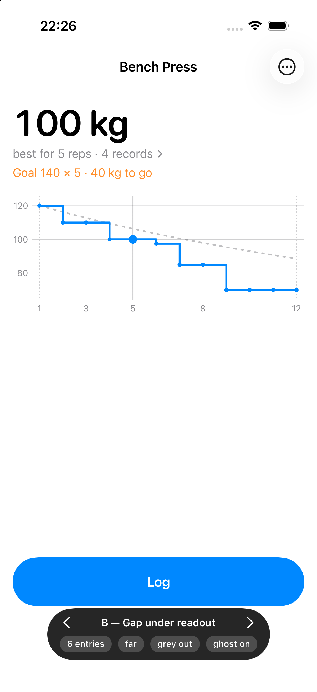 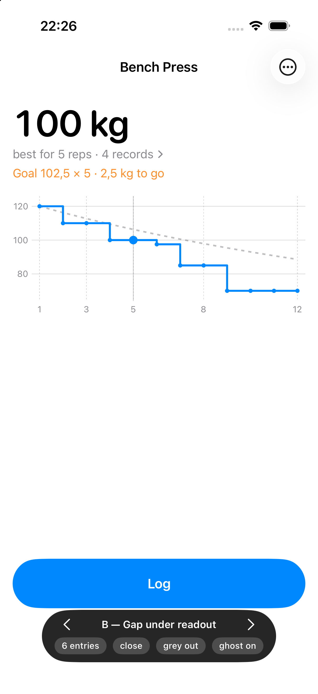 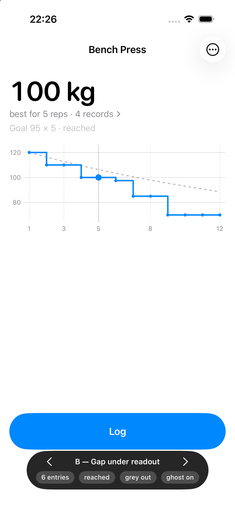 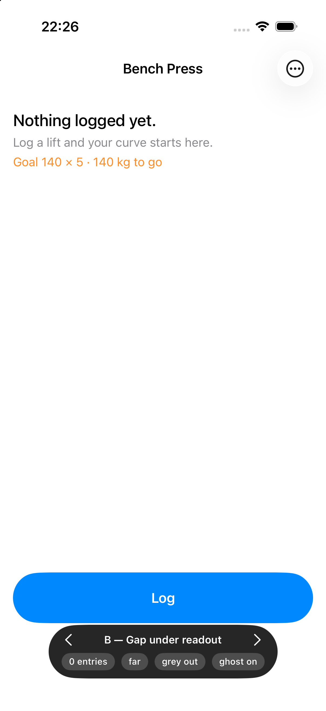 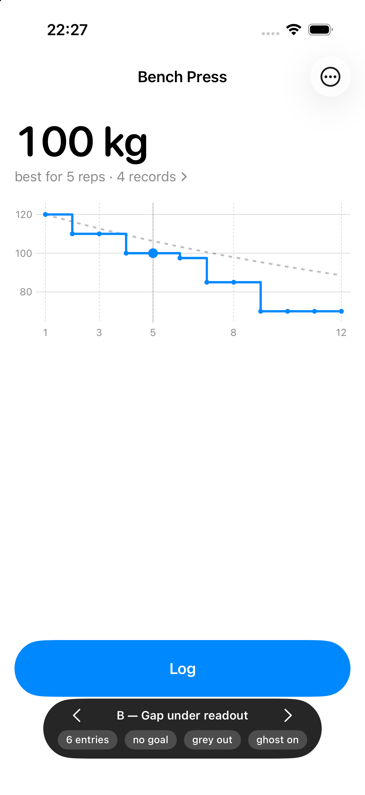

The cheapest of the four and the only one that changes nothing structural. It renders
identically with and without a curve, so the zero-entry case needs no second design. Its
open question is whether one subhead line is *enough* motivation — and whether the gap
should track the scrubbed rep count or stay fixed at the goal's own.

## C — A card in the empty space

far · reached · 0 entries

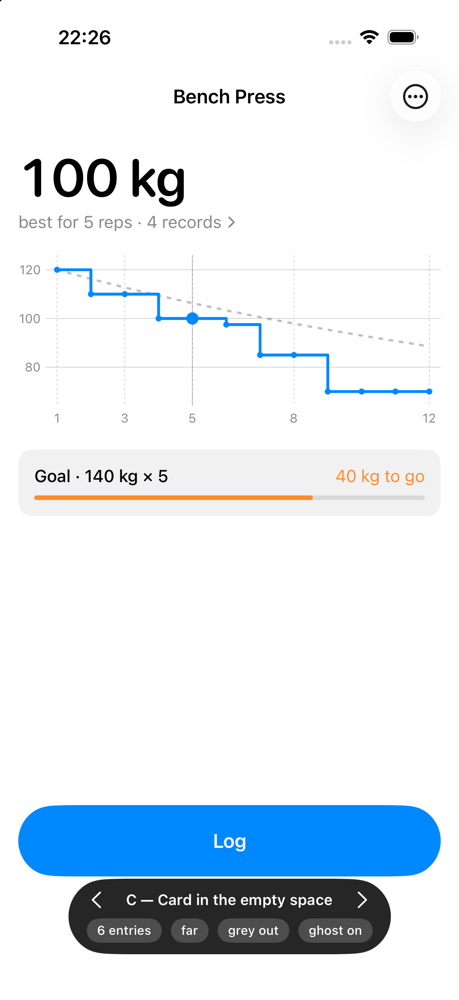 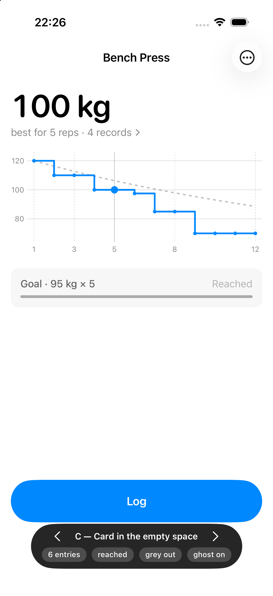 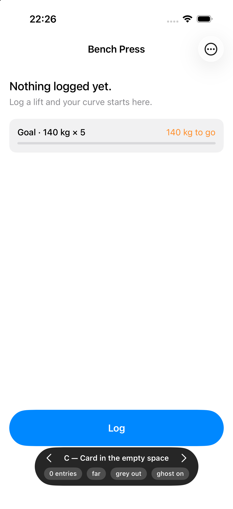

The most motivating and the most expensive: it spends the space §5.1 keeps deliberately
empty, and it is the app's one non-curve visual.

**The bar does not mean anything yet.** It runs from 0 kg to the goal, so 100 → 140 reads
as 71% done — but you were never at zero, and a beginner at 40 kg and a lifter at 100 kg
would both see a bar that is mostly full. Any bar needs an honest origin, and there isn't
an obvious one. Zero entries is the only case where 0 is the true origin.

## D — The gap is the headline

far · close · reached · 0 entries

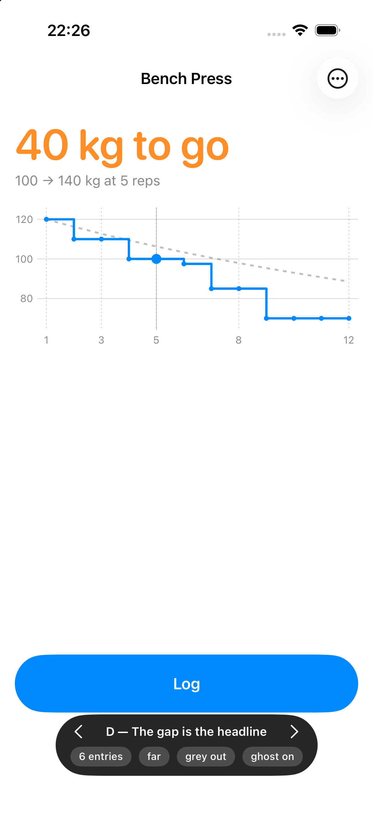 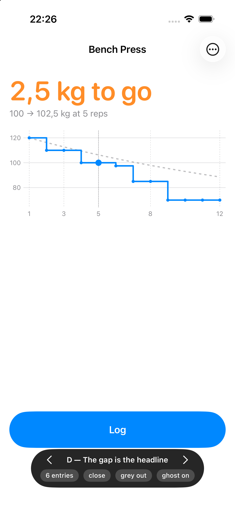 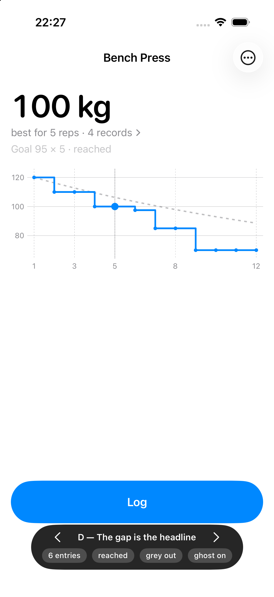 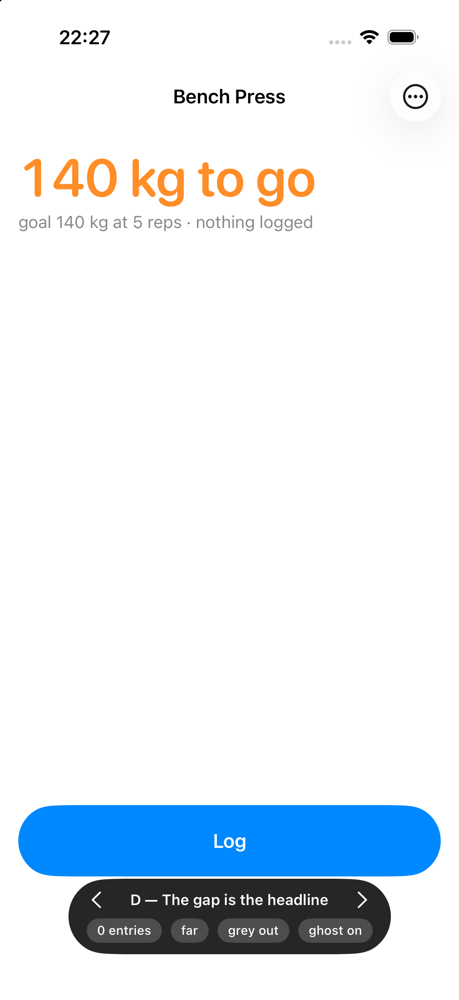

The only variant that changes what the screen is *about*, and the only one where the
motivation is the first thing you read.

Two costs, both visible above:

- **It spends the scrub readout.** The big number stops being `best[N]`, so scrubbing the
  curve has nothing to update and the screen's answer to *what do I load for 5?* is gone
  from the place it lived. `d-reached` shows the readout handed back once the goal is
  crossed — which means the screen has two headlines depending on a derived state.
- **`d-zero` reads as absurd**: `140 kg to go` with nothing logged, and §5.4's
  `Nothing logged yet.` displaced entirely.

## What the ghost toggle showed

`a-noghost` is the one shot with the ghost switched off. On A it buys back real legibility,
because the goal rule and the ghost are competing for the same band above the curve. On
B, C and D nothing competes with it — the goal never enters the chart — so the ghost has
no reason to leave. **Whether the ghost stays is therefore not an independent question: it
is a cost that only variant A incurs.**

## Assumptions, not decisions

- Orange is a placeholder for "not the curve, not the ghost". No colour decision is implied.
- The wording (`Goal 140 × 5 · 40 kg to go`) is scaffolding; it is
  [How is a goal set, changed and cleared?](https://github.com/hermanno3005/Chalk/issues/65)
  and the glossary that own the words.
- Every shot is free-weight. Nothing here varies by kind — the goal scopes as the curve
  scopes, and the qualifier is unchanged.
- The goal is fixed at 5 reps, the default selection, so the gap and the scrub agree. What
  a goal at 3 reps looks like while you are scrubbing 8 is not shown and is open.

---

# Round two — the line won, now what does it carry?

Round one settled the **placement** (a line under the readout) and the **reached
appearance** (grey out). Everything below holds those fixed and varies only what sits in
that line, plus one thing round one could not show at all: **what happens when you log.**

| | What the line carries |
|---|---|
| **R1 — Line only** | nothing — round one's winner, as the control |
| **R2 — Donut** | a 18 pt donut in front of the words |
| **R3 — Hairline bar** | a 3 pt track taking the row's leftover width |
| **R4 — The number moves** | no glyph; the gap animates and a `−2.5` chip says what the log took off |

 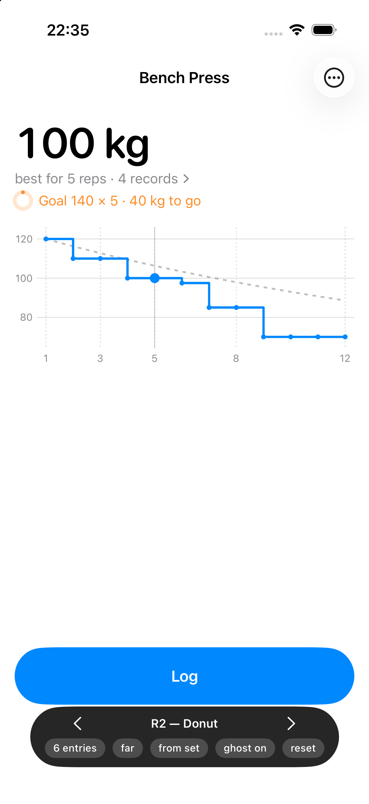  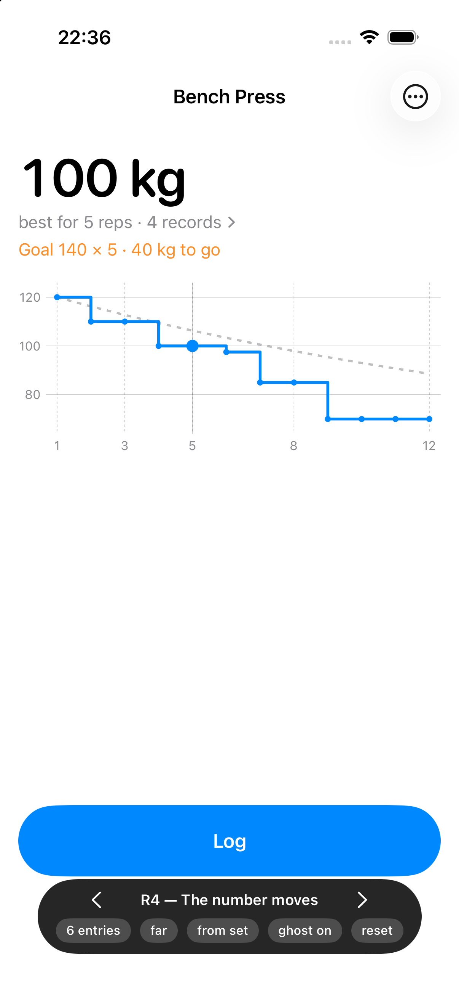

## The dynamic bit

`r2-far` → `r2-logged` is six taps of Log: the gap counts `40 → 25`, the donut fills, the
readout climbs `100 → 115` and the staircase rises under it, all on one 0.35 s spring.

 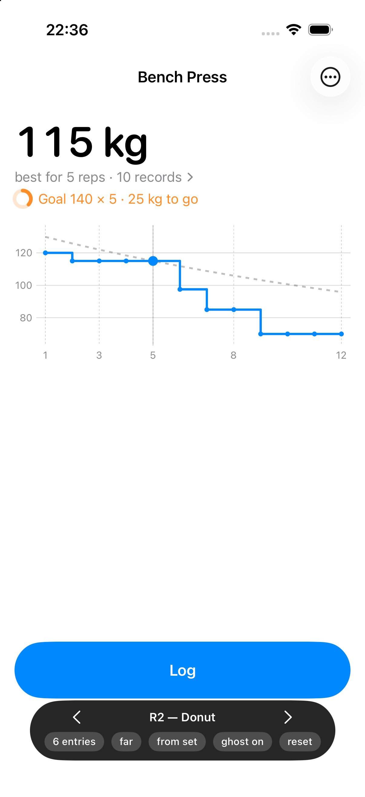

It works, and it exposes something the stills could not: **the gap is the only part of the
screen that reacts to a log in a way you feel.** The readout already moves, but it moves
whether or not you are heading anywhere. This is the argument for the feature in one
gesture.

From an empty screen it is the same story — `r2-zero` says `140 kg to go` against nothing,
and three logs in it is a real number against a real curve.

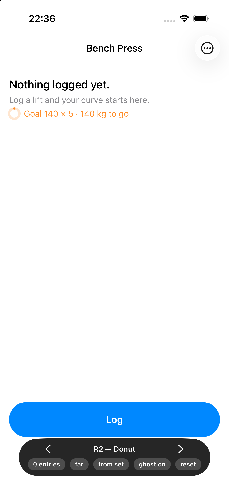 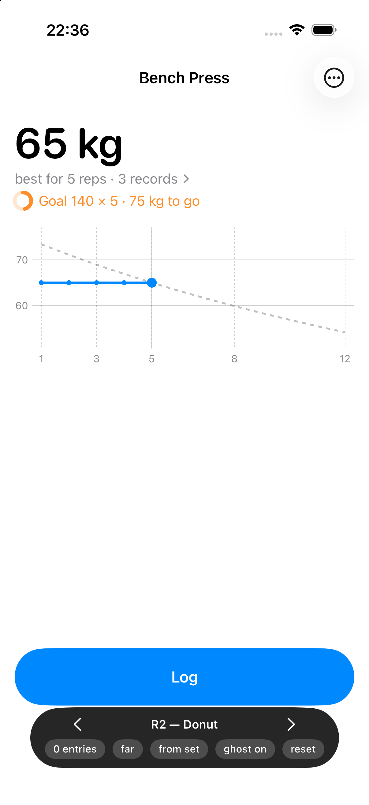

## The origin problem, made switchable

Round one found it in variant C and it follows any glyph: **a donut has to count from
somewhere.** The two shots below are the same numbers — `100 kg`, `40 kg to go` — under
the two answers:

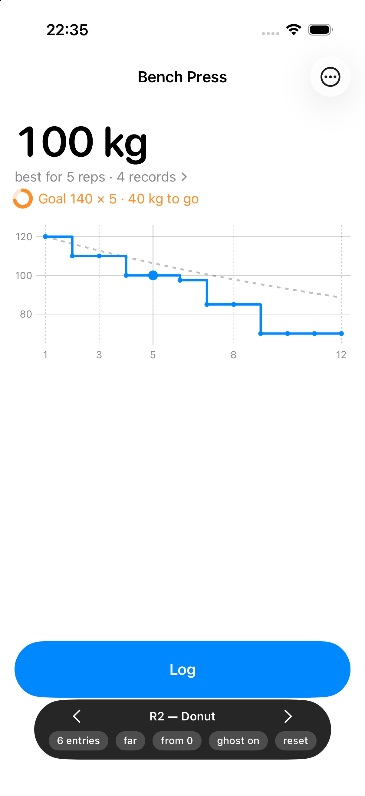 

- **`from 0`** — `best / goal`. Costs nothing to store, and it is a lie: you were never at
  zero, so it opens 71% full and a beginner's donut and a strong lifter's look the same.
- **`from set`** — `(best − best-when-set) / (goal − best-when-set)`. Honest, and it reads
  as real progress the moment you log. It costs **a second stored number**: what the curve
  read at that rep count when you named the goal.

That second number is the real decision here, and it is bigger than a glyph: it is another
stored value that is not a lift you performed, and it would need its own answer when an
entry is edited underneath it. **A donut is not free — it drags this with it.**

## What the shots say about each

- **R2 — Donut.** Reads as a gauge, not a chart, and at subhead height it does not outweigh
  the words. Filling it is the most satisfying of the four. Needs the origin answered.
- **R3 — Hairline bar.** The trailing track reads as an underline or a divider rather than
  as progress — it is the weakest of the four, and it also needs the origin answered.
- **R4 — The number moves.** The only one that costs nothing to store, because it shows a
  *difference* rather than a *proportion*. The `−2,5` chip as drawn is too loud and does
  not fade; it should be a brief flash, not a permanent badge.
- **R1 — Line only.** Still the cheapest, and against R2 the honest question is whether the
  donut earns a stored number.

 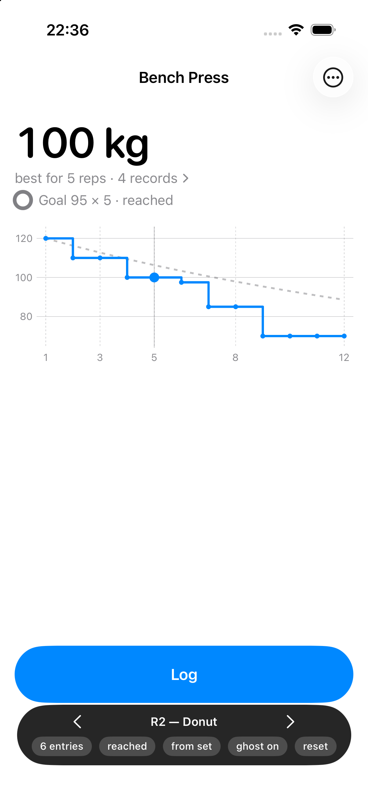 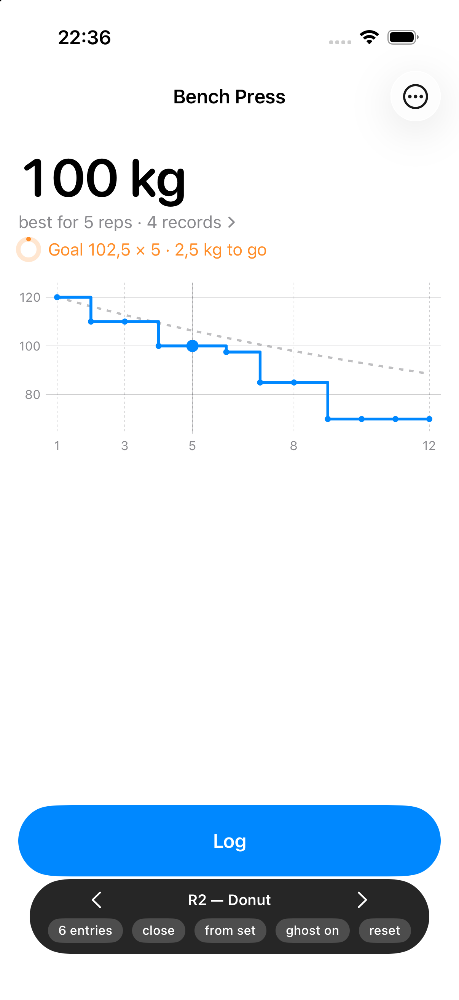

Grey-out survives everywhere: the donut greys with the words, full and quiet.
