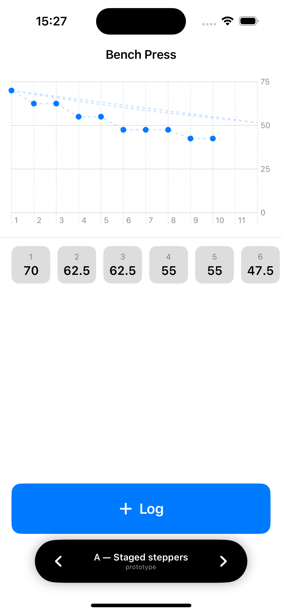
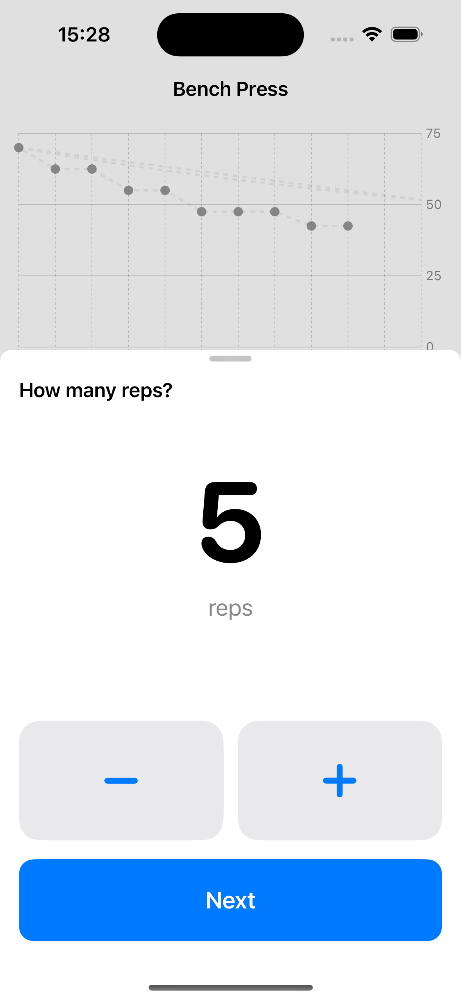
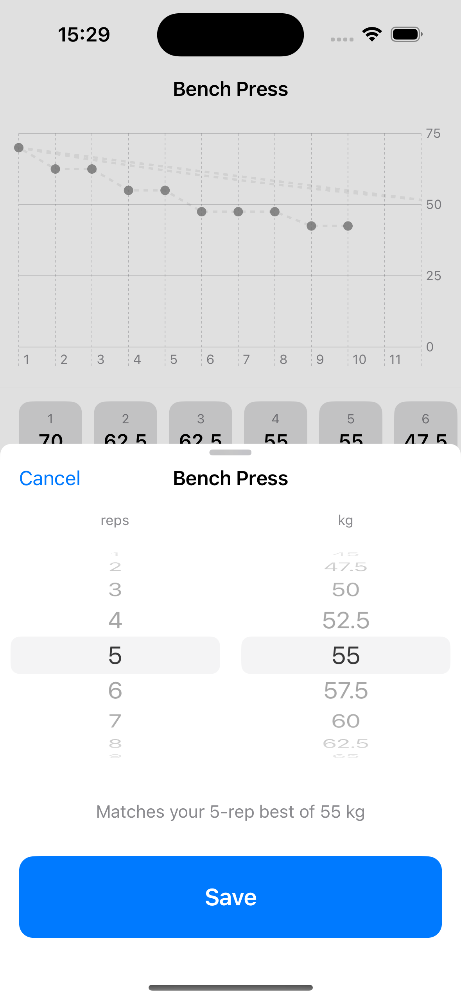
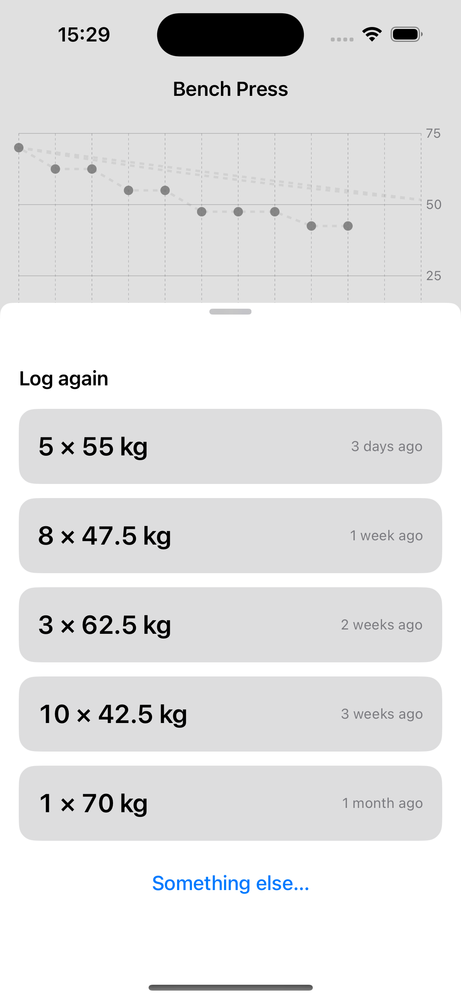
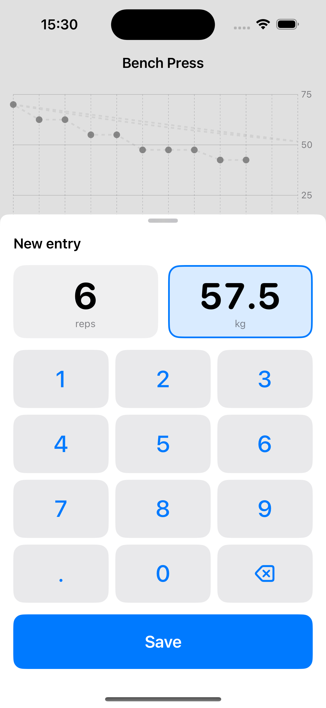

# PROTOTYPE — log-entry modal

Throwaway. Answers [Prototype the log-entry modal](https://github.com/hermanno3005/Chalk/issues/6).

Three variants of the log-entry modal, switchable from a floating bottom bar, hosted
on a rough exercise detail screen so the modal is judged against real density.

## Run it

Open `Chalk/Chalk.xcodeproj` on this branch and run. The app is rooted at
`LogEntryPrototypeRoot` instead of `ContentView`. Flip variants with the black pill
at the bottom; the choice is persisted, so it survives a relaunch.

Sample data is in memory only — nothing is written to SwiftData, and every relaunch
resets the six seeded records.

## The variants

| | Input | Seeded with | Order | Feedback |
|---|---|---|---|---|
| **A — Staged steppers** | Two 88pt stepper buttons, one number on screen at a time | Your most recent entry | Reps, then weight | Only on the weight stage |
| **B — One-screen wheels** | Two wheel pickers side by side | Last-used reps at your *current best* for that count | Neither — both at once | Live, under the wheels |
| **C — Repeat-first** | Tap a recent combination; keypad as fallback | n/a — the chips *are* the defaults | n/a (chips), reps→weight (keypad) | None on the chip path |

Weight steps are 2.5 kg throughout — an assumption, not a decision. Increments are
still fog on [the map](https://github.com/hermanno3005/Chalk/issues/1).

## Screenshots

Host screen — 

A —  · B —  · C —  · C keypad — 
